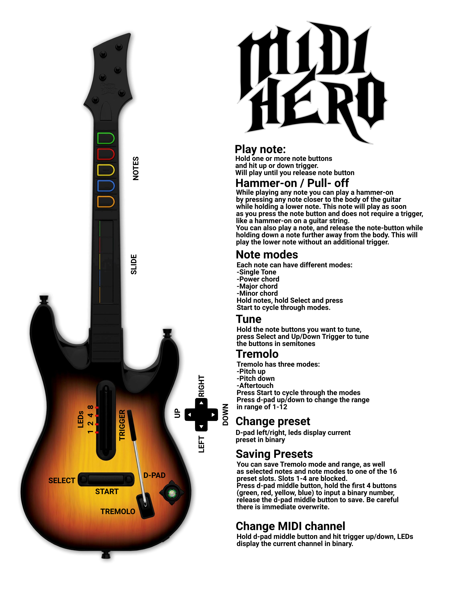
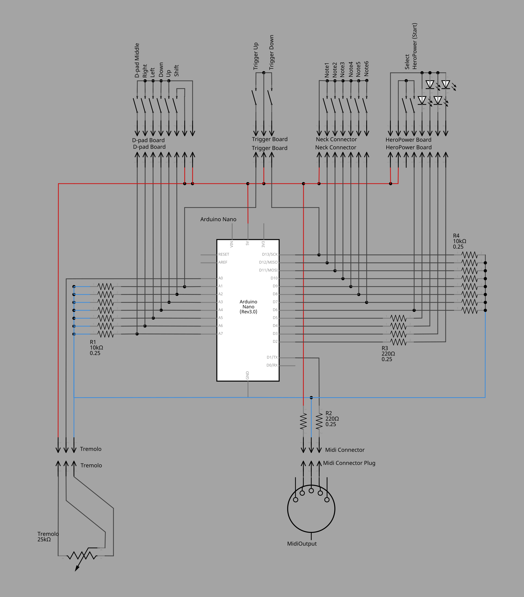

# 🎸 MidiHero
Transform your GuitarHero controller into a rockin' 5-pin MIDI controller for synths, man!
Btw, this readme was written by chatGPT in a "cool and authentic musician-to-musician-style" - enjoy!

## 🎶 Overview
This groovy repo provides the Arduino code and docs you need to turn a 6-button, PS3-gen GuitarHero controller into a rad MIDI controller. The modded axe sends MIDI notes through a 5-pin MIDI output, making it jam with any standard synth.

## 🎸 Guitar Components

## 🤘 Usage Instructions
### Playing Notes
To shred a note, press and hold one or more `note` buttons and hit that up/down `trigger`. The note will sustain as long as you hold the `note` button, just like a real guitar, bro! Strum the `trigger` in both directions to play some wicked fast licks.

### Preset Selection
Your guitar comes preloaded with four sick presets:
1. C major scale (C, D, E, F, G, A) - the happy one!
2. E minor pentatonic (E, G, A, Bb, D, E) - unleash your inner rock god!
3. C major pentatonic (C, D, E, G, A, C) - jam on this groovy scale!
4. C minor chord on top three notes, G minor chord on bottom three - get ready to riff!

The active preset shines bright with one of the four `LEDs`. Change presets by pressing the `HeroPower button`.

### Tremolo Functionality
Rock that `tremolo`! By default, it'll bend your pitch down by one semitone at full extension. You can adjust the bend range from 1 to 12 semitones! To change the range, press the `D-pad up/down`. Navigate the modes and watch for a flash of all `LEDs` to know you've made the switch. If no flash, you've hit the end of the range (1 or 12) - just navigate the other way, man!

Tremolo modes include:
* **Pitch Down** - Pitch bends down all notes by 1..12 semitones
* **Pitch Up** - Pitch bends up all notes by 1..12 semitones
* **Aftertouch** - Sends aftertouch (velocity) messages to modify current notes. With a synth like the Arturia MicroFreak, you can control anything through the modulation matrix - let your creativity flow!

You can change modes by pressing `D-pad left/right`.

### Guitar Tuning
Wanna tweak your presets? No problem, dude! Select a preset, then press and hold the `notes` you want to change. Adjust the pitch with `Shift + trigger up/down` for a semitone up or down. Transpose an entire preset by holding all notes and pressing `Shift + trigger up/down`. Just remember, custom presets won't be saved when you restart the guitar - they'll go back to default. But hey, it's a great way to reset if things get to funky!

### MIDI Channel Selection
By default, your guitar sends notes on MIDI channel 1. We recommend setting your synth to accept all MIDI notes - check the settings! But if you need a specific channel, press the `D-pad` down and use the `up/down trigger` to change the channel. The active channel is shown in binary with flashing LEDs, from Channel 1 (1000) to Channel 15 (1111), and Channel 16 (0000). Rock on!

## Schematics

## Internals

Inside the controller there is mostly Buttons that are placed on different boards. The neck is detachable and only contains the 6 `note` buttons and no additional circuitry, so it does not need to be opened or modified. Besides the buttons there is a potentiometer for the `tremolo`. Everything is attached to a controller through many flat ribbon cables. The controller is a bluetooth controller and could be used to turn something else into a guitarhero controller, maybe playing guitarhero with fruits? ;)

Inside the main frame there are 4 boards that contain several buttons. The boards usually have a GND-pin and several pins that can be connected to GND by pressing a button. To read the buttons with an arduino 5V is supplied to GND (don't get confused) of the board. The resulting signal is then read through a digital input pin with another grounding resistor. The circuit is as described in this tutorial:

https://docs.arduino.cc/built-in-examples/digital/Button

Details about the different boards:

### Neck Connector
Some pins are not used in my version of the controller, maybe there are other controllers with an additional uController inside the neck, for now only the button-pins are used.

Pinout:
1 - Vcc - not connected
2 - SWDCLK - not connected
3 - RST/SWDIO - not connected
4 - MODE - not connected
5 - W1 - note 1
6 - W2 - note 2
7 - W3 - note 3
8 - B1 - note 1
9 - B2 - note 2
10- B3 - note 3
11- GND

### Trigger Board

Pinout:
1 - GND
2 - DOWN
3 - UP

### HeroPower Board
Start is the signal for the big HeroPower button, select is the two small buttons beside it. The buttons cannot be read seperately and they are not used for this mod. The board also contains 4 leds that are supplied through Vcc. They can be directly connected to the arduino (sinking their current into a digital output pin) through a 220 Ohn Resistor.

Pinout:
1 - CH4 - LED4
2 - CH3 - LED3
3 - CH2 - LED2
4 - CH1 - LED1
5 - Vcc - +5V
6 - Start
7 - Select
8 - GND

### Navigation Board
The navigation board contains the `shift` button and the d-pad, the d-pad consists of 5 buttons, one for each direction and a center one that activates when pressing the middle of the dpad or pressing down the entire d-pad. This middle button can also activate randomly while nagvigating in some directions, so I recommend only using it to detect a complete push down of the d-pad by reading the middle button, and all directions at once.

Pinout:
1 - VB - Shift button
2 - POWER - seperate channel for shift button, also connect to +5V
3 - GND - also 5V+
4 - CH_KEY - d-pad middle button
5 - UP
6 - DOWN
7 - LEFT
8 - RIGHT

## Tutorials

### Arduino Midi Player Tutorial
I took the Midi Output Circuit from this
https://docs.arduino.cc/built-in-examples/communication/Midi

### Arduino Button Input Tutorial
This is the circuit used for all buttons inside the guitar. Be aware, that the buttons in the controller do have a bit more resistance while on than usual buttons (up to 300 Ohms), so make sure you use 10k resistors to GND, smaller resistors may cause glitches.
https://docs.arduino.cc/built-in-examples/digital/Button

