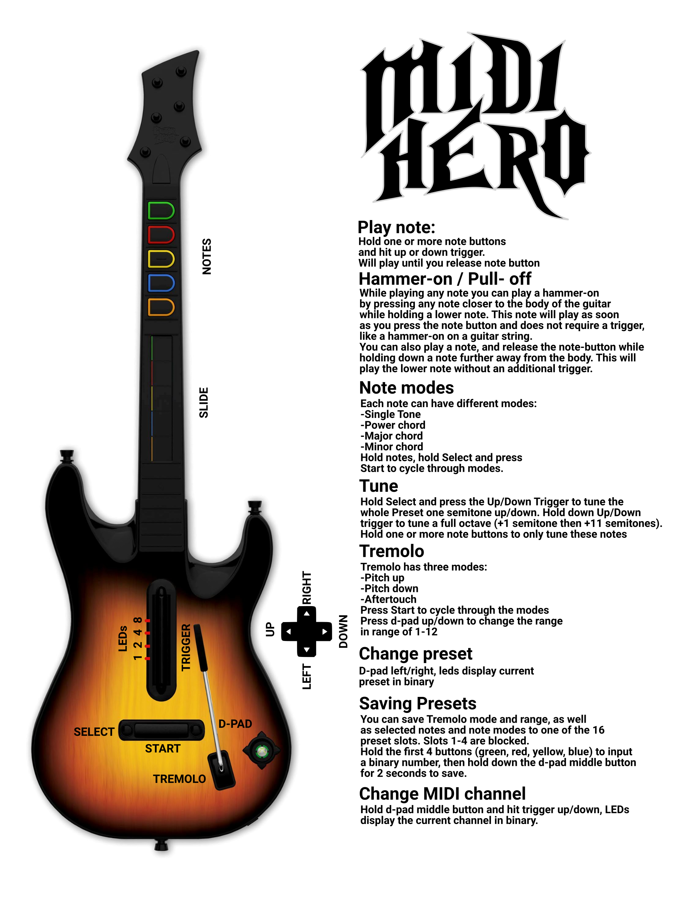
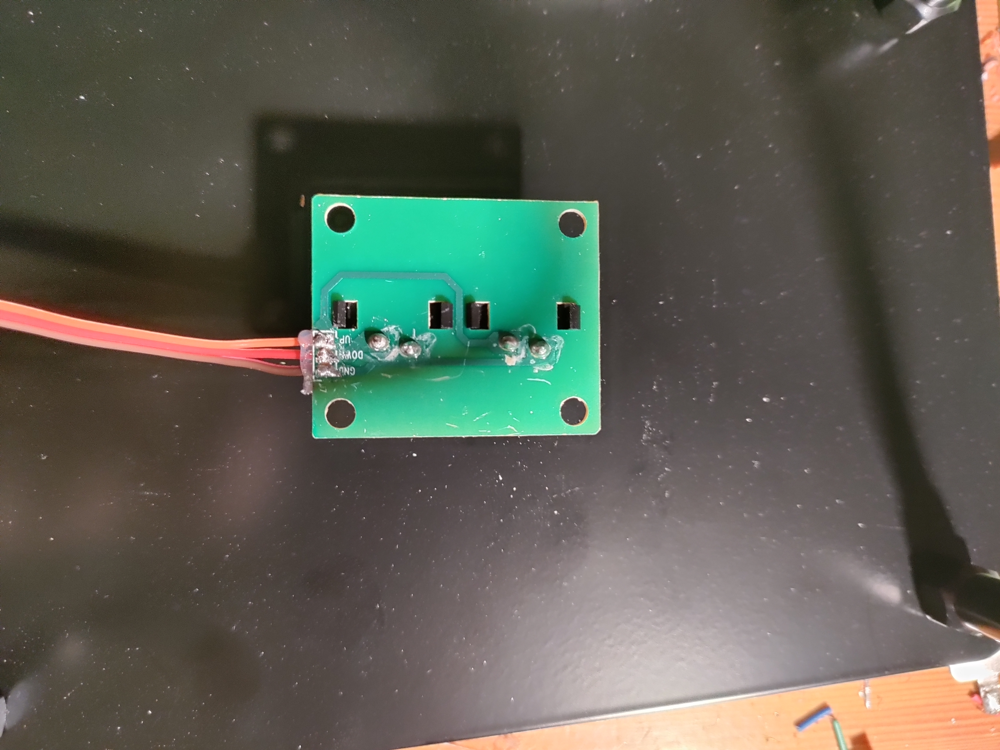

# 🎸 MidiHero
Transform your GuitarHero controller into a rockin' 5-pin MIDI controller for synths, man!
Btw, this readme was written by chatGPT in a "cool and authentic musician-to-musician-style" - enjoy!

## 🎶 Overview
This groovy repo provides the Arduino code and docs you need to turn a 5-button, PS3 GuitarHero controller into a rad MIDI controller. The modded axe sends MIDI notes through a 5-pin MIDI output, making it jam with any standard synth.

## 🤘 Usage Instructions

### Playing Notes
To shred a note, press and hold one or more `note` buttons and hit that up/down `trigger`. The note will sustain as long as you hold the `note` button, just like a real guitar, bro! Strum the `trigger` in both directions to play some wicked fast licks.

### Hammer-On / Pull-Off
While playing any note you can play a hammer-on by pressing any note closer to the body of the guitar while holding a lower note. This note will play as soon as you press the note button and does not require a trigger. You can also play a note, and release the note-button while holding down a note further away from the body. This will play the lower note without an additional trigger.

You can enable/disable hammeron functionality for any preset by holding `Select` and pressing `Start`.

### Preset Selection
Your guitar comes preloaded with 16 presets. A preset contains the currently selected notes and their modes, the current tremolo mode and tremolo range and a hammeron-flag. The LEDs indicate which is selected in binary. Press `d-pad left/right` to change the currently selected preset. Changes you make to a preset will remain until you reboot the guitar, unless you save your preset to permanently keep it on the instrument.

### Tremolo Functionality
Rock that `tremolo`! By default, it'll bend your pitch down by one semitone at full extension. You can adjust the bend range from 1 to 12 semitones! To change the range, press the `D-pad up/down`. Navigate the modes and watch for a flash of all `LEDs` to know you've made the switch. If no flash, you've hit the end of the range (1 or 12) - just navigate the other way, man!

Tremolo modes include:
* **Pitch Down** - Pitch bends down all notes by 1..12 semitones
* **Pitch Up** - Pitch bends up all notes by 1..12 semitones
* **Aftertouch** - Sends aftertouch (velocity) messages to modify current notes. With a synth like the Arturia MicroFreak, you can control anything through the modulation matrix - let your creativity flow!

You can change mode for your current preset by pressing `Start`.

### Guitar Tuning
Wanna tweak your presets? No problem, dude! Select a preset, then press and hold the `notes` you want to change. Adjust the pitch with `Shift + trigger up/down` for a semitone up or down. Transpose an entire preset by holding all notes and pressing `Shift + trigger up/down`. Just remember, custom presets won't be saved when you restart the guitar - they'll go back to default if not saved. But hey, it's a great way to reset if things get to funky!
You can also hold the up/down trigger while tuning to jump a full octave.

### Note Modes
Each note can have different modes:
* **Single Tone**
* **Power chord**
* **Major chord**
* **Minor chord**
Hold the notes you want to change, hold Select and press Start to cycle through their modes.

### MIDI Channel Selection
By default, your guitar sends notes on MIDI channel 1. We recommend setting your synth to accept all MIDI notes - check the settings! But if you need a specific channel, press the `D-pad` down and use the `up/down trigger` to change the channel. The active channel is shown in binary with flashing LEDs, from Channel 1 (1000) to Channel 15 (1111), and Channel 16 (0000). The channel is stored when device is powered off.

### Saving Presets
You can save Tremolo mode and range, as well as selected notes and note modes to one of the 16 preset slots. Hold the first 4 buttons (green, red, yellow, blue) to input a binary number, then hold the d-pad middle button to save. LEDs will blink when saved and go back to displaying the preset. Slots 1-4 are blocked and cannot be overwritten.

## Schematics

## Internals

Inside the controller there is mostly Buttons that are placed on different boards. The neck is detachable and only contains the 6 `note` buttons and no additional circuitry, so it does not need to be opened or modified. Besides the buttons there is a potentiometer for the `tremolo`. Everything is attached to a controller through many flat ribbon cables. The controller is a bluetooth controller and could be used to turn something else into a guitarhero controller, maybe playing guitarhero with fruits? ;)

Inside the main frame there are 4 boards that contain several buttons. The boards usually have a GND-pin and several pins that can be connected to GND by pressing a button. To read the buttons with an arduino 5V is supplied to GND (don't get confused) of the board. The resulting signal is then read through a digital input pin with another grounding resistor. The circuit is as described in this tutorial:

https://docs.arduino.cc/built-in-examples/digital/Button

Details about the different boards inside the controller:
See the pictures folder for images of other controllers.

### Neck Connector
Some pins are not used in my version of the controller, maybe there are other controllers with an additional uController inside the neck, for now only the button-pins are used.

Pinout:
* 1 - Vcc - not connected
* 2 - SWDCLK - not connected
* 3 - RST/SWDIO - not connected
* 4 - MODE - not connected
* 5 - W1 - note 1
* 6 - W2 - note 2
* 7 - W3 - note 3
* 8 - B1 - note 1
* 9 - B2 - note 2
* 10- B3 - note 3
* 11- GND

### Trigger Board

Pinout:
* 1 - GND
* 2 - DOWN
* 3 - UP

### HeroPower Board
Start is the signal for the big HeroPower button, select is the two small buttons beside it. The buttons cannot be read seperately and they are not used for this mod. The board also contains 4 leds that are supplied through Vcc. They can be directly connected to the arduino (sinking their current into a digital output pin) through a 220 Ohn Resistor.

Pinout:
* 1 - CH4 - LED4
* 2 - CH3 - LED3
* 3 - CH2 - LED2
* 4 - CH1 - LED1
* 5 - Vcc - +5V
* 6 - Start
* 7 - Select
* 8 - GND

### Navigation Board
The navigation board contains the `shift` button and the d-pad, the d-pad consists of 5 buttons, one for each direction and a center one that activates when pressing the middle of the dpad or pressing down the entire d-pad. This middle button can also activate randomly while nagvigating in some directions, so I recommend only using it to detect a complete push down of the d-pad by reading the middle button, and all directions at once.

Pinout:
* 1 - VB - Shift button
* 2 - POWER - seperate channel for shift button, also connect to +5V
* 3 - GND - also 5V+
* 4 - CH_KEY - d-pad middle button
* 5 - UP
* 6 - DOWN
* 7 - LEFT
* 8 - RIGHT

## The Controller
The code runs on a arduino nano and can be run through the arduino IDE.

The board mostly features pull-down resistors for all in- and output pins as in the button input tutorial. The signals from the different buttons are then connected to the arduino directly next to it's input pins as seen here:

### Rx pin
The code uses all digital and analog pins except for Rx. You may be able to use it somehow, but I got a but with error messages when uploading new code while the button was connected to anything but ground, so I decided not to use it and keep the select buttons unwired.

### Power supply

During debug the board is powered through USB via the USB port, in parallel there is a MP1584 buck converter wired to the Vin pin. The buck converter uses a 9V battery as power source and is adjusted to output +5V. So far it was fine having the usb-cable and the buck converter powering the board in parallel.

## Code
The code is split to two files for the 6 button PS3/PS4 version of the guitar and the 5 button PS3-Version. There are different models, but these two were most suitable, since both feature minimum 3 menu-buttons (dpad-middle, select and start) and 3 LEDs to indicate presets and other information.

My recommended model is the PS3 Guitar Hero World Tour Octane Red controller.

To run the code on your hardware, simply connect all wires from the different boards to your Arduinos IO pins. Important is only, that you use PWM-Pins for the LEDs (I use 6, 9, 10, 11). These are the only output pins. The other wires all connect to 5V, Gnd or any of the digital or analog input pins. I use A7 for the Tremolo potentiometer which is the only real analog input, the other wires are all digital.
You can connect them however it fits you and adjust the pin settings in the code in a dedicated section.

Once you have everything wired, I recommend to run the code and uncomment a debug-section that prints the different key-presses to the serial console. You can then look at the serial console and check if your key-mappings are correct. If not, adjust the input pins in the code.

Once this is done you can comment the section again and do a test with midi. Be aware that when printing to the serial console while having midi connected, the serial data will be send out through midi which usually leads to some pretty crazy sounds with your synthesizer. Very uncontrollable though.

The only adjustments you need to make is the pinouts, everything else should hopefully be ready to run.

## Tutorials

### Arduino Midi Player Tutorial
I took the Midi Output Circuit from this
https://docs.arduino.cc/built-in-examples/communication/Midi

### Arduino Button Input Tutorial
This is the circuit used for all buttons inside the guitar. Be aware, that the buttons in the controller do have a bit more resistance while on than usual buttons (up to 300 Ohms), so make sure you use 10k resistors to GND, smaller resistors may cause glitches.
https://docs.arduino.cc/built-in-examples/digital/Button

### Arduino Midi In- and Output
Same circuit as in the other tutorial, but also contains part for recieving midi which is a bit more complicated, but also doable. Also you don't necessarily need the Optocoupler circuit and can directly connect the data lines to your Rx pin, but decoupling is recommended of course.
https://www.instructables.com/Send-and-Receive-MIDI-with-Arduino/

